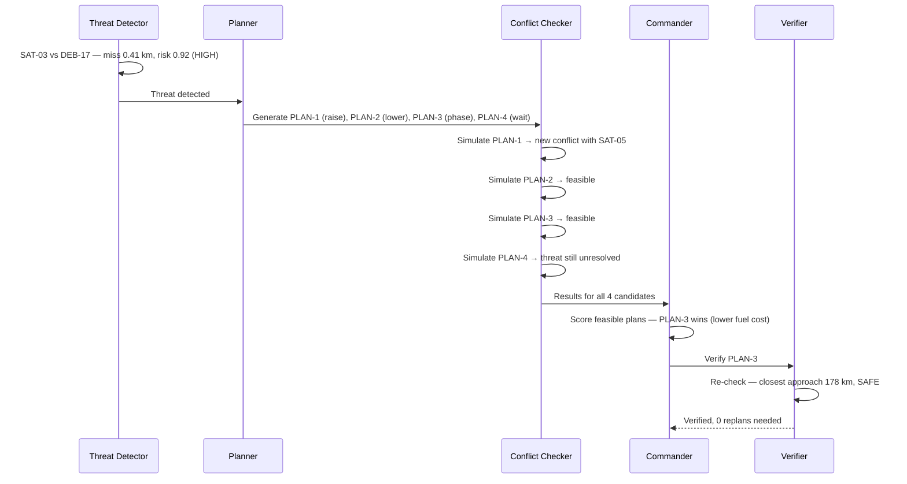

#  OrbitGuard

**An autonomous multi-agent system that doesn't just predict a collision it checks whether its own fix causes a new one.**

> *"What if the maneuver that saves a satellite from one collision creates another collision? OrbitGuard answers this by simulating the consequences of its own proposed actions before accepting them."*


---

##  The Idea

Space debris and satellite conjunctions are a real, growing problem. Most "AI collision avoidance" demos stop at detection — they flag a threat and stop. **OrbitGuard goes further**: when it proposes an avoidance maneuver, it re-simulates the *entire* scene with that maneuver applied, checks whether the "fix" creates a **new** dangerous conjunction with some other object, and only recommends a plan after that counterfactual check passes.

It's a decision-support prototype — it recommends and verifies, a human approves. It never fires real thrusters.

### Why this is interesting

| | |
|---|---|
| **Counterfactual self-checking** | The system doesn't trust its first idea — it simulates the consequences before accepting them |
| **Second-order conflict awareness** | A maneuver that solves one collision can create another. OrbitGuard explicitly searches for this and rejects unsafe plans |
| **Agentic workflow** | Observe → Reason → Simulate → Evaluate → Reject → Replan → Decide → Verify — not a single-shot prediction |

---

##  System Architecture

```mermaid
flowchart LR
    A[ Orbital Data] --> B[Threat Detector]
    B -->|conjunction found| C[Maneuver Planner]
    C -->|3-4 candidate plans| D[Conflict Checker]
    D -->|counterfactual simulation| E[Mission Guardian]
    E -->|criticality-weighted scores| F[Commander]
    F -->|selects best plan| G[Verifier]
    G -->|re-checks selected plan| H{Safe?}
    H -->|Yes| I[ Await Human Approval]
    H -->|No, retry once| F
    H -->|Still unsafe| J[ Escalate to Operator]

    style A fill:#0d1b2a,stroke:#4cc9f0,color:#fff
    style B fill:#1b263b,stroke:#4cc9f0,color:#fff
    style C fill:#1b263b,stroke:#4cc9f0,color:#fff
    style D fill:#1b263b,stroke:#f72585,color:#fff
    style E fill:#1b263b,stroke:#4cc9f0,color:#fff
    style F fill:#1b263b,stroke:#4cc9f0,color:#fff
    style G fill:#1b263b,stroke:#f72585,color:#fff
    style I fill:#0d1b2a,stroke:#4ade80,color:#fff
    style J fill:#0d1b2a,stroke:#facc15,color:#fff
```



### The five agents

| Agent | Deterministic Python | Gemini's role |
|---|---|---|
| **Threat Detector** | 100% — propagation, distance search, risk formula | None |
| **Maneuver Planner** | Computes the physical result of each candidate | Optional: comments on candidate ordering |
| **Conflict Checker** | 100% — re-simulates every candidate against every object | None |
| **Mission Guardian** | Criticality weighting lookup | Explains why criticality changed the ranking |
| **Commander** | Final weighted score (deterministic formula) | Writes the human-readable justification |
| **Verifier** | Re-runs Conflict Checker once on the selected plan | Optionally narrates the result |

**Key design rule:** Gemini never computes or invents a physical number. All orbital mechanics, distances, and scores are deterministic Python. The LLM only explains results that have already been calculated — this keeps the demo reliable and avoids hallucinated physics.

---

##  Tech Stack

| Layer | Technology |
|---|---|
| Frontend | React (Vite) + CesiumJS/Three.js + Tailwind CSS |
| Backend API | FastAPI (Python 3.11), Pydantic |
| Orbital mechanics | Two-body Keplerian propagation (numpy/scipy) |
| AI reasoning | Google Gemini (structured JSON output) |
| State | In-memory Python objects + shared JSON scenario file |
| Deployment | Local (`localhost`) for the demo |

---

##  Repository Structure

```
OrbitGuard_Prometheus/
├── backend/          # FastAPI service — propagation, detection, planning, scoring
├── agent/            # Multi-agent orchestrator + Gemini integration
├── frontend/         # React dashboard — 3D globe, decision-trace panel
├── contracts/        # Section 4 API schemas (source of truth for field names/types)
├── data/
│   └── mock_scenario.json   # Shared demo scenario — all components read from here
├── docs/
│   └── OrbitGuard_Project_Bible.pdf
└── README.md         # You are here
```

**Field names and types in `contracts/` are frozen.** All four components read/write the exact same JSON shapes — nobody renames a field without updating this and telling the team.

---

##  API Reference

All endpoints live in the backend (`http://localhost:8000`). Full request/response shapes are in `backend/models.py`.

| Method | Endpoint | Purpose |
|---|---|---|
| `GET` | `/api/scenario` | Current object set (satellites + debris) |
| `POST` | `/api/scenario/reset` | Reload the shared demo scenario |
| `GET` | `/api/threats` | Run detection, return active conjunctions |
| `POST` | `/api/plan` | Candidate maneuvers for a given threat |
| `POST` | `/api/simulate` | Counterfactual check for one candidate |
| `POST` | `/api/decide` | Full pipeline: score, verify, final decision |
| `POST` | `/api/approve` | Human sign-off flag |

**Conventions:** `snake_case` fields, ISO 8601 UTC timestamps, distances in km, velocities in km/s, delta-v in **m/s**, scores as floats `0.0–1.0`.

---

##  The Demo Scenario

A tuned, reproducible synthetic scenario — not live tracking data.



| Plan | Type | Result |
|---|---|---|
| **PLAN-1** | raise_orbit |  Rejected — creates a new high-risk conjunction with `SAT-05` (0.30 km, risk 0.94) |
| **PLAN-2** | lower_orbit |  Rejected — feasible, but loses to PLAN-3 on score |
| **PLAN-3** | phase_shift |  **Selected** — resolves cleanly, verified SAFE |
| **PLAN-4** | wait |  Rejected — doesn't resolve the threat within the window |

This is the exact story narrated live in the demo: *the system tries an idea, catches its own mistake, tries again, and only commits once it's verified safe.*

---

##  Getting Started

### Backend
```bash
cd backend
python3.11 -m venv venv
source venv/bin/activate
pip install -r requirements.txt
uvicorn main:app --reload --port 8000
```
API docs auto-generate at `http://localhost:8000/docs`.

### Agent
```bash
cd agent
# see agent/README or in-file docs for GEMINI_API_KEY setup
```

### Frontend
```bash
cd frontend
npm install
npm run dev
```

---

##  Guardrails

- This is a **decision-support prototype** for a controlled demo scenario not a flight-certified or operational space-agency system.
- Orbital data is **synthetic and controlled**, not live classified conjunction data.
- A **human operator** approves the final maneuver. The system recommends and verifies; it does not autonomously command any spacecraft.

---

##  Team

| Role | Owns |
|---|---|
| Architecture / Integration | Project bible, API contracts, pitch, cross-team integration |
| Backend | FastAPI service, orbital propagation, conjunction detection, maneuver + counterfactual simulation |
| Frontend | React + 3D globe dashboard, decision-trace UI |
| AI Agent | Multi-agent orchestrator, Gemini integration, Commander justification |

---

##  Full Specification

See [`docs/OrbitGuard_Project_Bible.pdf`](docs/OrbitGuard_Project_Bible.pdf) for the complete internal spec — architecture rationale, judging rubric mapping, execution timeline, and fallback plans.
